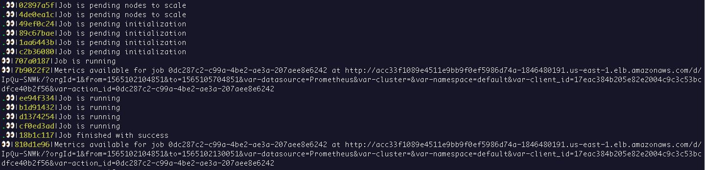
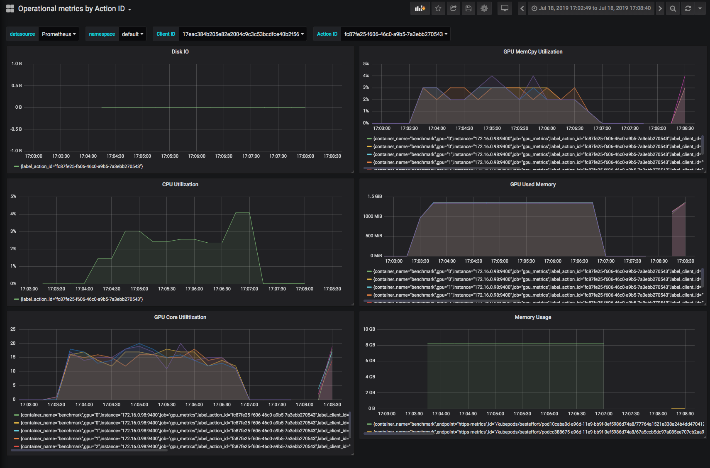
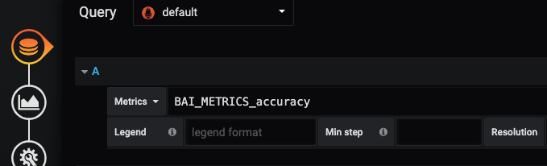

A "framework/tool/service" that enables you to perform benchmarks of your machine learning models/frameworks/hardware in order to evaluate functionality, performance and detect regressions.


Anubis provides a simple, self service solution for teams to schedule and run benchmarks for machine learning workloads.  Abubis lets teams to easily spin-up the required infrastructure and automation to perform benchmarks. Consider Anubis a measuring tool, a "ruler" if you willl, that lets you measure the efficacy of your machine learning model, framework and/or computing infrastructure.  Anubis provides a simple, declartive, input descriptor, and produces operational and user metrics, and sophisticated alerts for detecting regressions.  Logged output from the model are stored and indexed for deeper inspection, allowing for more effective root cause investigation.

# Features

* Simple single [_declarative__ input file](executor#descriptor-file) that gives user full control of Model / Framework / Hardware dimensions
  ([TOML](https://github.com/toml-lang/toml) format)
* Simple command-line interface
* Strong Reproducibility
* Efficient Dataset Caching
* Ease of use and deployment
* Encourages and enables self-service paradigm (anyone can spin up Anubis)
* Designed to be future proof
* Built around open standards
* Cloud native, cloud ready and cloud scalable ++

Work loads:
* benchmarks training and inference work loads
* [kubeflow](https://www.kubeflow.org) support (MPI jobs).
* [horovod](https://github.com/horovod/horovod) support

Metrics:
* provides [dashboard](https://grafana.com/grafana/) of operational metrics for runs
* provides capability to [dashboard](https://grafana.com/grafana/) user defined metrics for runs
* powerful query and alerting capabilities (leveraging [Prometheus](https://prometheus.io) [PromQL](https://prometheus.io/docs/prometheus/latest/querying/basics/) + [Alert Manager](https://prometheus.io/docs/prometheus/latest/configuration/alerting_rules/))

Log search:
* nimbly [search](https://www.elastic.co/products/elasticsearch) benchmark output for deeper investigation and trouble shooting

_++Takes advantage of your cloud provider or datacenter's available resources - currently supports AWS out-of-the-box".  Including the option to export data to [CloudWatch](https://aws.amazon.com/cloudwatch/)_


# Usage

<b>Anubis</b> provides <b>two</b> fundamental scripts.

One is the installer [`anubis-setup`](docs/anubis-setup.md), that is used to...

- create, configure, operate and destroy the Anubis infrastructure

The other is the [`anubis`](bai-bff/docs/anubis-client.md) client tool that allows users to...

- run a benchmark: `anbis --submit resnet50-descriptor.toml`
- monitor the progress of a run's activities `anubis --status`
- obtain information from a benchmark that was run: `anubis --results`

The envisioned use-case is that a team or group or org instantiates the service infrastructure to be be used by its constituents. As such only the "admin" needs to run [`anubis-setup`](docs/anubis-setup.md).  While all users of Anubis interact with it using the `anubis` client tool.

For more information on how to use [`anubis-setup`](docs/anubis-setup.md), including use case examples and option explanations, please see the [full documentation here](docs/anubis-setup.md).<br>
For more information on how to use the [`anubis`](bai-bff/docs/anubis-client.md) client, please see its [starter document](bai-bff/docs/anubis-client.md).

<hr>
<i>
Why is it called "Anubis"? Because Anubis is the Egyptian God of the
afterlife. Anubis would weigh the goodness of your heart to decide if
you passed through to the after life. In this context, Anubis weighs
the goodness of your machine learning model, framework and
hardware. ;-)
</i>
<hr>

# Quick start

## Step 0 - Requirements

1. Get AWS credentials on your environment variables.
   It can be either `AWS_PROFILE` or `AWS_ACCESS_KEY_ID`/`AWS_SECRET_ACCESS_KEY`.
   [This guide](https://docs.aws.amazon.com/sdk-for-java/v1/developer-guide/setup-credentials.html) helps setting these
   variables (ignore the fact it says it's for the Java SDK).
2. We use [CONDA](https://docs.conda.io/en/latest/index.html) as our way to stabilize the environment in which we run code.  Please install CONDA, the recommended installation is posted [here](https://docs.conda.io/en/latest/miniconda.html).
3. Install **bash** version 5+

After you have installed these tools, please open up a new terminal (the simplest way to come up in a clean new state).<br>
*Note - If your shell session comes up with the default "(base)" conda environment, deactivate the "(base)" environment with the following command:*

```bash
conda deactivate
```

Now, you are now ready to proceed :-)

```bash
git clone https://github.com/awslabs/benchmark-ai.git
cd benchmark-ai
```


## Step 1 - Create the infrastructure
(If you are only interested in using an existing Anubis service instance skip this section and jump to [Step 2](#step-2---register-the-client))


#### Overview...
The installation process... consists of two phases - 1) configuring and deploying *infrastructure* services, and then 2) configuring and deploying *orchestration* services.

**Infrastructure**:
- Uses [Terraform](https://www.terraform.io/) to create all of the infrastructure:
    - Kubernetes - [EKS](https://aws.amazon.com/eks) cluster
    - [Elasticsearch](https://aws.amazon.com/elasticsearch-service/) cluster
    - Kafka - [MSK](http://aws.amazon.com/msk) cluster
    - [Prometheus](https://prometheus.io/) broker and Alert Manager
- Adds Pods to Kubernetes:
    - FluentD
    - Autoscaler
    - NVIDIA device plugin

**Orchestration services**:
 - BFF
 - Fetcher
 - Executor
 - Watcher
----

### Installation Options:

#### Via Code Pipeline (recommended)

You will now create a [Codebuild](https://aws.amazon.com/codebuild/) pipeline that deploys Anubis infrastructure and orchestration services in your AWS account using the default region us-east-1 (this can be changed from benchmark-ai/ci/variables.tf):

```bash
# Assuming PWD is `benchmark-ai`
./anubis-setup -- --region us-east-1 --prefix-list-id pl-xxxxxxxx
```

Inspect the output line presented, if okay, type 'yes' when prompted and terraform will create the Codebuild pipeline and its dependencies.  When terraform finishes navigate to the AWS console -> Codebuild -> Pipeline -> Pipelines -> Anubis on the console to see the status of the installation.  The general run time of the pipeline is approximately 50 minutes.

<details><summary>More about anubis-setup "driver" arguments</summary>
<p>

 - region: (REQUIRED) AWS region that Anubis infrastructure and services will be instantiated in.  There can only be one instantiation of Anubis per account due to IAM role name collisions, etc.
 - prefix-list-id: (REQUIRED) In order to access Anubis infrastructure from corp we can add the corresponding corp prefix list from the Amazon Prefix List Lookup tool
 - extra-users: *Provide as comma delimited list arn:aws:iam::1234:user/user1,arn:aws:iam::1234:user/user2* In order for a user to directly run kubectl commands against the Anubis EKS cluster you must provide that user's IAM ARN.  By default the users that are added are the Codebuild pipeline user, and your current aws user (find this out by running `aws sts get-caller-identity`)
 - extra-roles: Same as extra-users except with AWS IAM roles
 - white-listed-cidrs: Provides cidrs to whitelist so that Anubis may be reached from outside the Amazon network
 - github-organization / github-branch: To point the pipeline to track a branch other than master, good for personal pipeline development
 - chime-hook-url: Provide a chime URL for notification of pipeline failures
 - clean: Deletes the terraform statefile, backend config, terraform variable file, and terraform plan file.  Useful for debugging failures or resetting configuration.
 - destroy: Deletes Anubis infrastructure and pipeline

</p>
</details>

##### Get the service endpoint for Anubis

Once the Anubis pipeline has completed, at least the `deploy` stage, successfully you will be presented with the Anubis service endpoint and asked to _register_ to it.  You may subsequently ask the installation for its service endpoint by making an explicit request:

``` bash
> anubis-setup --show-service-endpoint
Fetching service endpoint value...

Configured service endpoint is: [xxxxxxxxxxx-xxxx.us-east-1.elb.amazonaws.com:80]
```
_(give this to anubis client users so that they may [`--register`](#registration) the endpoint, more [later](#registration))_


**OR...**

#### Via the "no frills" instantiation

This form also does a full instantiation of the Anubis service (infrastructure and orchestration services).  However, with this installation mechanism you will **not** get any of the CI/CD benefits provided by code pipeline.  This means that to apply any updates you would have to do so explicitly by re-issuing the command or by using the appropriate flags that give you control down to the service level ([see documentation for more details](docs/anubis-setup.md)).  The "no frills" option is more high touch, and as such offers a bit more control over what services get updated, when and how.  The installation process is run locally! This means, make sure you have stable network connectivity and sufficient power (for those using laptops).

``` bash
# Assuming PWD is `benchmark-ai`
pushd baictl
./baictl create infra --aws-region={region} --aws-prefix-list-id={matching prefix list}
popd
./bin/build-and-deploy-all-services
```

<details><summary>(advanced usage)</summary>
<p>
The directory `baictl/drivers/aws/cluster/.terraform/bai` is created with everything related to the infrastructure (kubeconfig, bastion_private.pem, etc.).
</p>
</details>


## Step 2 - Register The Client

Once the instantiation of the anubis *infrastructure* is complete you may begin to use the [`anubis`](bai-bff/docs/anubis-client.md) client to interact with the system.

#### Download the client:

To use the Anubis client tool you do **not** need to clone the repository, you simply need to download the client.

``` bash
curl http://xxxxxxxxxxx-xxxx.us-east-1.elb.amazonaws.com:80/api/tools/anubis -o anubis
```
(It is recommended to put the anubis script somewhere in your $PATH)

#### Register the client:

Once you have downloaded the [`anubis`](bai-bff/docs/anubis-client.md) client you must point it to the Anubis service you wish to interact with. You do this by *registering* your infrastructure's *service endpoint* with the client.  Use the **--register** flag supplying the network **address** and **port** of your Anubis instantiation.  This will be provided to you _out-of-band_ by the Anubis service administrator.  This is the value that was provided at the end of the installation process (above).

``` bash
# Assuming PWD is `benchmark-ai`
bai-bff/bin/anubis --register xxxxxxxxxxx-xxxx.us-east-1.elb.amazonaws.com:80
```

To check that the client has registered with the Anubis instantiation, **--ping** it.

``` bash
# Assuming PWD is `benchmark-ai`
bai-bff/bin/anubis --ping

                       _      _
                      | |    (_)
   __ _  _ __   _   _ | |__   _  ___
  / _  ||  _ \ | | | ||  _ \ | |/ __|
 | (_| || | | || |_| || |_) || |\__ \
  \__,_||_| |_| \__,_||_.__/ |_||___/ ♎

(v0.1.0-481dad2)
-------------------------
AWS: Benchmark AI Client
-------------------------

Brought to you by the cool peeps of the  MXNet-Berlin Team
..........
Current service endpoint is: [xxxxxxxxxxx-xxxx.us-east-1.elb.amazonaws.com:80]

😎  Ready And Willing like Big Daddy Kane

```
This means you are good to go ;-) - Nice work.

-----

## Step 3 - Run benchmarks

To run benchmarks and generally interact with Anubis, use the [Anubis client tool](bai-bff/bin/anubis) ([starter doc here](bai-bff/docs/anubis-client.md)).

Anubis provides some sample benchmarks at the `benchmark-ai/sample-benchmarks` directory. Let's run some of them:

```bash
# Assuming PWD is `benchmark-ai`
bai-bff/bin/anubis --submit sample-benchmarks/hello-world/descriptor.toml
```

By doing this you submitted a benchmark run to Anubis (which is a [Kubernetes job](https://kubernetes.io/docs/concepts/workloads/controllers/jobs-run-to-completion/) by the way),
and the following will be done:

- The [descriptor file](executor#descriptor-file) is read and validated (must adhere to [schema](bai-bff/resources/descriptor_schema.json)).
- Anubis submits a job to Kubernetes
- Kubernetes allocates node(s) for you (using [Cluster Autoscaler](https://github.com/kubernetes/autoscaler/tree/master/cluster-autoscaler)).
- The benchmark runs, emitting metrics via the `emit()` method provided by the [client-lib](https://github.com/awslabs/benchmark-ai/tree/master/client-lib).
- Logs are collected into:
    - ElasticSearch
- Metrics are collected into:
    - Prometheus (both operational metrics, such as CPU or GPU utilization rates, and user defined metrics, such as accuracy or throughput)
    - CloudWatch (only user defined metrics)

*hint: put bai-bff/bin/anubis, or symlink to it, in your $PATH*

Anubis supports "Script Mode".  This means along with posting the [descriptor file](executor#descriptor-file), you may also specify and include the actual code that you wish to run.  This is a great way to more explicitly separate your model code from the framework you want to run. See our "Hello World" [README](sample-benchmarks/hello-world) for info on that.  Also look at the `anubis` client program [document](bai-bff/docs/anubis-client.md) located in the bff service.

```bash
#To watch the status messages showing the progress of the run
bai-bff/bin/anubis --watch --status
```

### (To Cancel)

```bash
#To cancel a run that is in progress (already been submitted but not completed)
bai-bff/bin/anubis --cancel <ACTION_ID>

#To definitively cancel a run in progress and all sub processes.
bai-bff/bin/anubis --purge <ACTION_ID>
```

## Step 4 - View the results of your run


### Model output

Using the `--results` option of the [Anubis client tool](bai-bff/bin/anubis) will print out the STDOUT output of your run.

```bash
# Assuming PWD is `benchmark-ai`
bai-bff/bin/anubis --results <ACTION_ID>
```

### Benchmark metrics

Anubis runs generate two kinds of metrics: _operational_ and _user defined_. Operational metrics inform of
the health of the nodes running the benchmarks, such as CPU or GPU utilization, and are collected by default when running any Anubis job.
On the other hand, user defined metrics must be specified in the [descriptor TOML](executor#descriptor-file) and can contain any kind of data.
Typical examples for user defined metrics are accuracy and throughput.


#### Operational metrics

The system exports all operational metrics to [Prometheus](https://prometheus.io). They can be viewed using [Grafana dashboards](https://grafana.com/grafana/).
These dashboards can be accesed either by:
 - Using `./anubis-setup --query-graphs`
 - Following the link provided by the anubis client when a submitted benchmark starts running:
 

The operational metrics dashboard looks as follows:



#### User defined metrics

Users can define custom metrics in the _output.metrics_ section of the descriptor TOML.
These get exported to Prometheus with the prefix BAI_METRICS, and with the following labels:

 - _action-id_ of the benchmark run which produced them.
 - _client-id_ of the user who submitted the benchmark.
 - All **custom labels** defined in the _info.labels_ section of the descriptor file which defined the benchmark.

 As an example, take a metric defined as follows:

 ```toml
[[output.metrics]]
# Name of the metric that will appear in the dashboards.
name = "accuracy"

# Metric unit (required)
units = "ratio"

# Pattern for log parsing for this metric.
pattern = "accuracy=([-+]?\\d*\\.\\d+|\\d+)"
```

It will be accesible in grafana as _BAI_METRICS_accuracy_. Therefore, it can be queried to create a custom dashboard which displays it:




## Step 5 - Destroy Anubis Infrastructure

```bash
# Assuming PWD is `benchmark-ai`
./anubis-setup -- --region us-east-1 --prefix-list-id pl-xxxxxxxx --destroy
```

*Note - There is a bug in terraform where security group don't get revoked before security group deletion causing timeout https://github.com/hashicorp/terraform/issues/8617*

## Great, what's next?

Write your own benchmarks!

Explore the [descriptor file format](executor/README.md)
in order to run your benchmarks in Benchmark AI. Make sure to post metrics by integrating the [client library](https://github.com/awslabs/benchmark-ai/tree/master/client-lib)
in your code.

Future Feature Roadmap...

<details><summary>User Metrics Dashboard Auto-Generation</summary>
<p>

To automatically generate User Metrics Dashboard to provide user defined metrics displayed to the customer.  This entails
providing a means of dynamically producing dashboards for a given run based on what is being collected/emitted.

</p>
</details>

<details><summary>Persistent metrics, raw events and log storage</summary>
<p>

Being able to have all events recorded durably would be advantageous
as it would result in having "event datasets" that enable further
out-of-band investigations or reporting.

<ul>

<li> Events: Listen to Kafka and dump all the events for each topic to
S3.
<li> Logs: We are using fluentD to push logs to ElasticSearch. This
can be configured to write to s3 (I believe - need to confirm)
<li> Metrics: This means having a persistence story for Prometheus
metrics which are rather opaque and not amenable to simple file
writing.  There is a story and write up for this capability, executing
it will manifest this feature.
</ul>
</p>
</details>

<details><summary>Report generation</summary>
<p>

Processing systems to generate reports akin to those presented now
with "BAI 1.0".  Report generation entails looking through data to put
together the insights you seek.  This is largely out-of-band
processing happening at the egress end of the system, and goes hand in
hand with the raw persistence story.

</p>
</details>

<details><summary>AMI Support</summary>
<p>

For Anubis to support running jobs across "bare metal" AMIs.

This feature can be supported in three phases.
<ul>
<li> Implementing an executor that can provision EC2 instances and imbue them with software to coordinate runs. The first pass would be running single node jobs.
<li> Following that is setting up for multi-node jobs
<li> Finally, addressing the alerting story in this context.
</ul>

</p>
</details>
<details><summary>Alerting</summary>
<p>

With regards to metrics, we want to be able to alert the user if there
are exceptional conditions based on the metrics values.  This is
allows the system to be used for regression detection among other
things.  Anubis sets up Prometheus as well as the Prometheus Alert
Manager. We will directly leveraged it to satisfy all reasonable
alerting needs.  The trick here is to figure out how to capture the
alerting rules. This may, most likely, be written as a new stanza in
the TOML.

</p>
</details>
<details><summary>AWS: Improved AZ selection</summary>
<p>

Availability Zones can be specified explicitly in the TOML descriptor,
if not they are randomly selected.  The random selection could lead to
running pods in zones that don't have the resources desired.  This
leads to the system not being able to run a benchmark, and spinning
forever waiting for resources that are not present and never
returning.  The low hanging fruit here would be to set a max timeout
threshold for waiting on resources.  The better solution would be to
connect to an API (or some information) where you can determine that
the resources desired are present.

</p>
</details>
<details><summary>Range capabilities in TOML</summary>
<p>

We want to be able to specify ranges of values across the *framework*,
*model*, *hardware* axes.  This would generate the cross product of
results. This would be especially useful in the hyper parameter
optimization space.  This feature would require the introduction of an
aggregating identifying attribute that would group action ids into an
"action-id-family" With the action-id-family, the notion of experiment
can be realized - as a set of actions / runs that are semantically
related.

</p>
</details>

# Design and architecture

The system is built to embody a few guiding tenets ([see details](/docs/anubis-project-tenets.md)):

<ul>
  <li>Self Service</li>
  <li>"Push Button" Installation</li>
  <li>Complete Delivery</li>
  <li>Clear Mental Model (Transparency)</li>
  <li>Use best of breed technology that has significant mind share</li>
</ul>

There are many design and implementation decisions were made, all of them well informed.  Please read our [Anubis Design FAQ](/docs/anubis-architecture-faq.md) if you are curious.

The picture below shows the "infrastructure" layer of Anubis.


The orchestration layer consists of services running on K8s, sending
[events](docs/anubis-event-design.md#benchmark-ai-event-design) to
each other to coordinate the activities necessary to shepherd model
runs. More specifically events are sent to kafka on specified topics.
Kafka facilitates the event sending throughout Anubis.


#### Technologies

This project is an exercise in the amalgamation and orchestration of several technologies to create a tool that adds value to our users.

- Python: (https://www.python.org/)
- Clojure: (https://clojure.org/),  (https://www.braveclojure.com/do-things/)
- Bash: (https://www.tldp.org/LDP/abs/html/)
- Jq: (https://stedolan.github.io/jq/)
- Conda: (https://docs.conda.io/projects/conda/en/latest/index.html)
- Docker: (https://www.docker.com/)
- Kafka: (http://kafka.apache.org/intro) (MSK)
- Kubernetes: (https://kubernetes.io/) (EKS)
- Prometheus: (https://prometheus.io/)
- Terraform: (https://www.terraform.io/)
- Zookeeper: (https://zookeeper.apache.org/)
- ElasticSearch: (https://www.elastic.co/products/elasticsearch) (Managed ElasticSearch)

# Supported cloud providers
(currently)
- AWS
