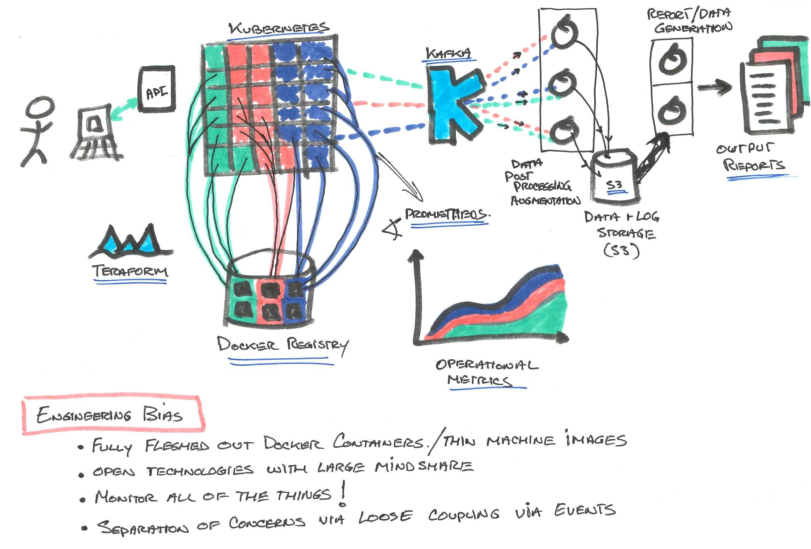

A "framework/tool/service" that enables you to perform benchmarks of your machine learning models/frameworks/hardware in order to evaluate functionality, performance and detect regressions.


Anubis provides a simple, self service solution for teams to schedule and run benchmarks for machine learning workloads.  Abubis lets teams to easily spin-up the required infrastructure and automation to perform benchmarks. Consider Anubis a measuring tool, a "ruler" if you willl, that lets you measure the efficacy of your machine learning model, framework and/or computing infrastructure.  Anubis provides a simple, declartive, input descriptor, and produces operational and user metrics, and sophisticated alerts for detecting regressions.  Logged output from the model are stored and indexed for deeper inspection, allowing for more effective root cause investigation.

# Features

* Simple _declarative_ _document-based_ input that gives user full control of Model / Framework / Hardware
* Simple command-line interface
* Strong Reproducibility
* Efficient Dataset Caching
* Ease of use and deployment
* Enables self-service model (anyone can spin up Anubis)
* Designed to be future proof
* Built around open standards
* Cloud native, cloud ready and cloud scalable*
* Operational Metrics

*Takes advantage of your cloud provider or datacenter's available resources - currently supports AWS out-of-the-box"


# Usage

<b>Anubis</b> provides <b>two</b> fundamental scripts.

One is the installer [`anubis-setup`](docs/anubis-setup.md), that is used to...

- configure and create the Anubis infrastructure

The other is the [`anubis`](bff/docs/anubis-client.md) client tool that allows users to...

- run a benchmark: `anbis --submit resnet50-descriptor.toml`
- monitor the progress of a run activities `anubis --status`
- obtain information from a benchmark that was run: `anubis --results`

The envisioned use-case is that a team or group or org instantiates the service infrastructure to be be used by its constituents. As such only the "admin" needs to run `anubis-setup`.  While all users of Anubis interact with it using the `anubis` client tool.

For more information on how to use `anubis-setup`, including use case examples and option explanations, please see the [full documentation here](docs/anubis-setup.md).<br>
For more information on how to use the `anubis` client, please see its [starter document](bff/docs/anubis-client.md).

<hr>
<i>
Why is it called "Anubis"? Because Anubis is the Egyptian God of the
afterlife. Anubis would weigh the goodness of your heart to decide if
you passed through to the after life. In this context, Anubis weighs
the goodness of your machine learning model, framework and
hardware. ;-)
</i>
<hr>

# Build status

| Project        | badge                                                                                                                                                                                                                                                                                                                     |
| :------------- | :------------------------------------------------------------------------------------------------------------------------------------------------------------------------------------------------------------------------------------------------------------------------------------------------------------------------ |
| baictl         |          |
| bff            |             |
| client-lib     |      |
| executor       |        |
| fetcher        |         |
| fetcher-job    |     |
| kafka-utils    |     |
| metrics-pusher |  |
| puller         |          |
| watcher        |         |

# Quick start

## Step 0 - Requirements

1. Get AWS credentials on your environment variables.
   It can be either `AWS_PROFILE` or `AWS_ACCESS_KEY_ID`/`AWS_SECRET_ACCESS_KEY`.
   [This guide](https://docs.aws.amazon.com/sdk-for-java/v1/developer-guide/setup-credentials.html) helps setting these
   variables (ignore the fact it says it's for the Java SDK).
2. We use [CONDA](https://docs.conda.io/en/latest/index.html) as our way to stabilize the environment in which we run code.  Please install CONDA, the recommended installation is posted [here](https://docs.conda.io/en/latest/miniconda.html).
3. Install **bash** version 5+


You are now ready to create the environment to use the tool:

```bash
git clone https://github.com/MXNetEdge/benchmark-ai.git
cd benchmark-ai
```


## Step 1 - Create the infrastructure

#### Overview...
The installation process... consists of two phases - 1) configuring and deploying *infrastructure* services, and then 2) configuring and deploying *orchestration* services.

**Infrastructure**:
- Uses [Terraform](https://www.terraform.io/) to create all of the infrastructure:
    - Kubernetes - [EKS](https://aws.amazon.com/eks) cluster
    - [Elasticsearch](https://aws.amazon.com/elasticsearch-service/) cluster
    - Kafka - [MSK](http://aws.amazon.com/msk) cluster
    - [Prometheus](https://prometheus.io/) broker and Alert Manager
- Adds Pods to Kubernetes:
    - FluentD
    - Autoscaler
    - NVIDIA device plugin

**Orchestration services**:
 - BFF
 - Fetcher
 - Executor
 - Watcher
----

### Installation Options:

#### Via Code Pipeline (recommended)

You will now create a Codebuild pipeline that deploys Anubis infrastructure and orchestration services in your AWS account using the default region us-east-1 (this can be changed from benchmark-ai/ci/variables.tf):

```bash
# Assuming PWD is `benchmark-ai`
./anubis-setup --region=us-east-1 --prefix-list-id pl-xxxxxxxx
```
Type 'yes' when prompted and terraform will create the Codebuild pipeline and its dependencies.  When terraform finishes navigate to the AWS console -> Codebuild -> Pipeline -> Pipelines -> Anubis on the console to see the status of the installation

<details><summary><strong>More about anubis-setup arguments</strong></summary>
<p>

 - region: (REQUIRED) AWS region that Anubis infrastructure and services will be instantiated in.  There can only be one instantiation of Anubis per account due to IAM role name collisions, etc.
 - prefix-list-id: (REQUIRED) In order to access Anubis infrastructure from corp we can add the corresponding corp prefix list from the Amazon Prefix List Lookup tool
 - extra-users: *Provide as comma delimited list arn:aws:iam::1234:user/user1,arn:aws:iam::1234:user/user2* In order for a user to directly run kubectl commands against the Anubis EKS cluster you must provide that user's IAM ARN.  By default the users that are added are the Codebuild pipeline user, and your current aws user (find this out by running `aws sts get-caller-identity`)
 - extra-roles: Same as extra-users except with AWS IAM roles
 - chime-hook-url: Provide a chime URL for notification of pipeline failures
 - clean: Deletes the terraform statefile, backend config, terraform variable file, and terraform plan file.  Useful for debugging failures or resetting configuration.
 - destroy: Deletes Anubis infrastructure and pipeline

</p>
</details>

##### Get the service endpoint for Anubis

Once the Anubis pipeline has completed atleast the `deploy` step successfully you need to query the EKS cluster for the Anubis endpoint.

```bash
# Assuming PWD is `benchmark-ai`
cd baictl
conda env update && conda activate baictl
./baictl sync infra --aws-region=us-east-1 --mode=pull
conda deactivate
# The kubeconfig will be downloaded to `drivers/aws/cluster/.terraform/bai/kubeconfig`
kubectl --kubeconfig=drivers/aws/cluster/.terraform/bai/kubeconfig get service bai-bff -o json | jq '.status.loadBalancer.ingress[].hostname'
```

**OR**

#### Via the "no frills" instantiation

This form also does a full instantiation of the Anubis service (infrastructure and orchestration services).  However, with this installation mechanism you will **not** get any of the CI/CD benefits provided by code pipeline.  This means that to apply any updates you would have to do so explicitly by re-issuing the command or by using the appropriate flags that give you control down to the service level ([see documentation for more details](docs/anubis-setup.md)).  The "no frills" option is more high touch, and as such offers a bit more control over what services get updated, when and how.

``` bash
# Assuming PWD is `benchmark-ai`
pushd baictl
conda env update
conda activate baictl
./baictl create infra --aws-region={region} --aws-prefix-list-id={matching prefix list}
popd
./build-and-deploy-all-services
```


**Advanced usage**: The directory `baictl/drivers/aws/cluster/.terraform/bai` is created with everything related to the infrastructure (kubeconfig, bastion_private.pem, etc.).

## Step 2 - Run benchmarks

To run benchmarks and generally interact with Anubis, use the [Anubis client tool](bff/bin/anubis) ([starter doc here](bff/docs/anubis-client.md)).

Anubis provides some sample benchmarks at the `benchmark-ai/sample-benchmarks` directory. Let's run some of them:

```bash
# Assuming PWD is `benchmark-ai`
bff/bin/anubis --submit sample-benchmarks/hello-world/descriptor.toml
```

By doing this you submitted a benchmark run to Anubis (which is a [Kubernetes job](https://kubernetes.io/docs/concepts/workloads/controllers/jobs-run-to-completion/) by the way),
and the following will be done:

- The descriptor file is read and validated.
- Anubis submits a job to Kubernetes
- Kubernetes allocates node(s) for you (using [Cluster Autoscaler](https://github.com/kubernetes/autoscaler/tree/master/cluster-autoscaler)).
- The benchmark runs, emitting metrics via the `emit()` method provided by the [client-lib](https://github.com/MXNetEdge/benchmark-ai/tree/master/client-lib).
- Logs are collected into:
    - ElasticSearch
- Metrics are collected into:
    - Prometheus

*hint: put bff/bin/anubis, or symlink to it, in your $PATH*

Anubis supports "Script Mode".  This means along with posting the descriptor file, you may also specify and include the actual code that you wish to run.  This is a great way to more explicitly separate your model code from the framework you want to run. See our "Hello World" [README](sample-benchmarks/hello-world) for info on that.  Also look at the `anubis` client program [document](bff/docs/anubis-client.md) located in the bff service.

```bash
#To watch the status messages showing the progress of the run
bff/bin/anubis --watch --status
```


## Step 3 - Collect the results of your run

```bash
# Assuming PWD is `benchmark-ai`
bff/bin/anubis --results <ACTION_ID>
```

## Step 4 - Destroy Anubis Infrastructure

```bash
# Assuming PWD is `benchmark-ai`
./anubis-setup --region=us-east-1 --prefix-list-id pl-xxxxxxxx --destroy
```

## Great, what's next?

Write your own benchmarks!

Explore the [descriptor file format](executor/README.md)
in order to run your benchmarks in Benchmark AI. Make sure to post metrics by integrating the [client library](https://github.com/MXNetEdge/benchmark-ai/tree/master/client-lib)
in your code.

Future Feature Roadmap...

- [x] Cronjobs
- [ ] Global status state
- [ ] User Metrics
- [ ] AWS: Cloudwatch exporting
- [ ] Alerting
- [ ] AWS: Improved AZ selection
- [ ] Distributed ML training benchmarks
- [ ] Range capabilities in TOML
- [ ] Persistent raw event and log storage
- [ ] Report generation

# Design and architecture

The system is built to embody a few guiding tenets:

<ul>
  <li>Self Service</li>
  <li>"Push Button" Installation</li>
  <li>Complete Delivery</li>
  <li>Use best of breed technology that has significant mind share</li>
</ul>



#### Technologies

This project is an exercise in the amalgamation and orchestration of several technologies to create a tool that adds value to our users.

- Python: (https://www.python.org/)
- Clojure: (https://clojure.org/),  (https://www.braveclojure.com/do-things/)
- Bash: (https://www.tldp.org/LDP/abs/html/)
- Jq: (https://stedolan.github.io/jq/)
- Conda: (https://docs.conda.io/projects/conda/en/latest/index.html)
- Docker: (https://www.docker.com/)
- Kafka: (http://kafka.apache.org/intro) (MSK)
- Kubernetes: (https://kubernetes.io/) (EKS)
- Prometheus: (https://prometheus.io/)
- Terraform: (https://www.terraform.io/)
- Zookeeper: (https://zookeeper.apache.org/)
- ElasticSearch: (https://www.elastic.co/products/elasticsearch) (Managed ElasticSearch)

# Supported cloud providers
(currently)
- AWS
