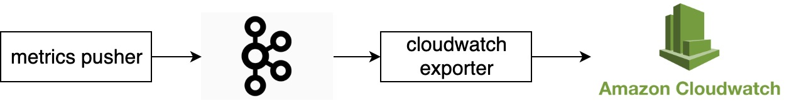

# User defined metrics in CloudWatch

All metrics defined in the _output.metrics_ section of the [descriptor TOML file](../executor/README.md) are automatically exported to AWS CloudWatch.
Accessing CloudWatch via the AWS console, they can be found in the _metrics_ section, under the namespace **ANUBIS/METRICS**.

 
CloudWatch metrics are accessible at ``https://console.aws.amazon.com/cloudwatch/home?region=<AWS_REGION>#metricsV2:graph=~();namespace=~'ANUBIS*2fMETRICS`` - 
substitute <AWS_REGION> with your region id, such as `us-east-1`, for example.

Metrics are labeled using:
 - _action-id_ of the benchmark run which produced them.
 - _client-id_ of the user who submitted the benchmark.
 - All **custom labels** defined in the _info.labels_ section of the descriptor file which defined the benchmark. 
 (see the [example descriptors](https://github.com/awslabs/benchmark-ai/blob/master/executor/README.md#training) for reference)
 
 
 ## Example
 
 Let's take the following TOML extract as an example. It defines one custom metric, named _accuracy_. Besides, it also
 specifies a custom label for this benchmark job: _experiment_, whose value is "test1".
 
 ```toml
[info]

# ...

[info.labels]
experiment = "test1"

# ...

[[output.metrics]]
# Name of the metric that will appear in the dashboards.
name = "accuracy"

# Metric unit (required)
units = "ratio"

# Pattern for log parsing for this metric.
pattern = "accuracy=([-+]?\\d*\\.\\d+|\\d+)"
```

With this settings, one metric would be published to CloudWatch, under the namespace ANUBIS/METRICS and with metric name
 **accuracy**. It would have three dimensions: `action-id = <ACTION_ID>`, `client-id = <CLIENT_ID>` and `experiment = test1`.


## How it works

User defined metrics are published to Kafka by the [metrics pusher](../metrics-pusher), specifically to the BAI_METRICS topic
(this is defined in the [metrics pusher configuration](https://github.com/awslabs/benchmark-ai/blob/880fa33c208f39906647b7482f5ff1667d418d1d/executor/src/transpiler/templates/job_single_node.yaml#L167)).
The CloudWatch exporter is a Kubernetes deployment which subscribes to this topic and publishes all metrics it receives 
to CloudWatch using boto3.

