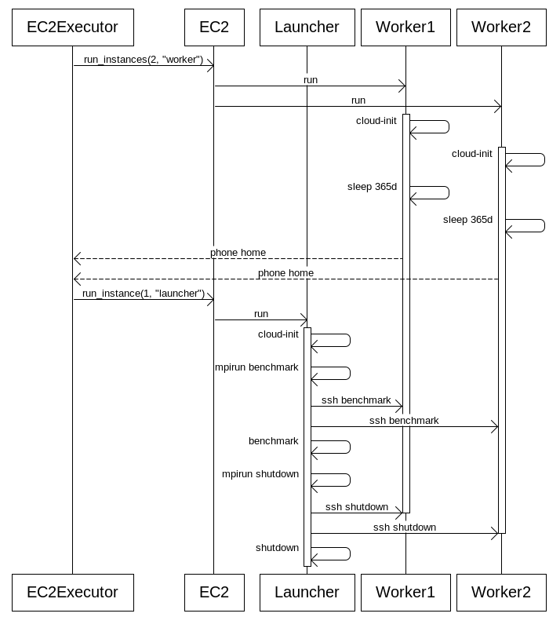

# DLAMI bare metal executor

## Problem

We have to run a test with just script mode on some AMI.

## Solution

In order to achieve the goal we create a new executor.
In this document we discuss different aspects of the implementation. The ami-executor can be potentially the most complicated one, since we cannot rely anymore on any existing middleware. We cannot use k8s/ecs/kubeflow.

Instead of that we suggest using to reuse as much code/mind models as possible with replacing pod by a benchmark-job agent running on an E2 instance.
We introduce a new component of the system, **EC2 benchmark agent**, that will be deployed to every EC2 node and run the benchmark.

### Why don’t we use AWS Batch?

AWS Batch is a service atop of ECS. So it cannot be used in our bare AMI use-case.

## TOML Changes

```
[info]
execution_engine="aws.ec2"

# Instead of docker_image for the EC2 execution engine
[aws.ec2]
image="..."
```

A reasonable alternative is to unify the image names and replace our env.docker_image, to env.image, which will be interpreted by a specific executor.


```
[info]
execution_engine="aws.ec2"

# docker_image can be renamed to image for all the executors.
[env]
image="..."
```

## Instance Spin-Up

### Instance creation

We can create the necessary number of the instances using boto3 ec2 client.
https://boto3.amazonaws.com/v1/documentation/api/latest/reference/services/ec2.html#EC2.Client.run_instances

### Instance initialization

We will need some additional software to be installed on the instance.
For example in the case of distributed training we can imagine openmpi to be a requirement.

**O1. User Data Initialization**
UserData parameter is intended to be used for that:
https://docs.aws.amazon.com/AWSEC2/latest/UserGuide/user-data.html#user-data-shell-scripts

cloud-init seems to be a more portable option, since we don’t know the package manager of the targeted AMI. Alternative can be to do some probing for the present install in a bash.
Look here for details: https://cloudinit.readthedocs.io/en/latest/topics/examples.html#install-arbitrary-packages

**O2. SSH Initialisation**
Not recommended because of complicated state management.

### What do we need?

* **conda** to avoid collisions with installed python software and manage dependencies.
* **aws** for puller
* **bsdtar** for puller
* **openmpi** for horovod
* **openssh** for openmpi - Clarify if it’s enough to have the expected AMI’s own **ssh**.

The dependencies can be managed with conda, as long as they are present as conda packages

Besides of that we may need ssh keys for distributed training, so the launcher can ssh to the nodes.
https://cloudinit.readthedocs.io/en/latest/topics/examples.html#configure-instances-ssh-keys

### How do we know, that the initialization is finished?

**O1. ssh to the host and wait for a file dumped by cloud-init on completion.**
https://www.digitalocean.com/community/questions/how-to-make-sure-that-cloud-init-finished-running
Con:

* Seems like a hack, depending on cloud-init internals

**O2. Make cloud-init call home**
https://cloudinit.readthedocs.io/en/latest/topics/examples.html#call-a-url-when-finished
Pro:

* Cleaner solution - we call a lambda or the service itself.

Con:

* Additional component

**O3. Don’t wait. Put benchmark code in the cloud-init**
Pro:

* We get an url callback as soon as we are done.
* Benchmark gets fire-and-forget

Con:

* Check for timeout, if this works.

**O3.1 Don’t wait. Start a “job agent” from cloud-init. (Recommended)**
Pro:

* We get more control over the execution - the job-agent can phone-home on his own.
* Fire-and-forget benchmark
* We don’t have to worry about cloud-init potential troubles with shutdown.

### How do we track instances assigned to jobs?

We tag instances on creation in the same way we tag k8s objects.

### What about larger datasets?

Since fetcher provides the size of the dataset, we can easily estimate the size of the necessary volume and pass it to boto3.client**.**run_instances BlockDeviceMappings.

### What’s the IAM role of the instance?

We can reuse the benchmark-host role - essentially the role of the benchmark pod used with kube2iam.
The role must basically:

* Read from scripts-exchange S3
* Read from data-pull S3

### How do we distribute the job-agents?

wget/aws the tar from s3 seems the easiest option.

## Benchmark Execution

Since we cannot use our typical 4-5 containers pod, we have to accomplish the same tasks on our own without docker.
On the other side we can think aforementioned [job-agent](https://quip-amazon.com/z4IjAn7cua78/DLAMI-bare-metal-executor#Hfb9CAH50XU) as an art pod-replacement.

### What are the tasks accomplished by the job agent?

Job agent is started from cloud-init and is responsible for running the benchmark. It’s our equivalent of a benchmark pod.

### How do we pass the benchmark into to Job Agent?

We may pass a small JSON/YAML/TOML through user data to be read by the job agent.


|	|Benchmark Pod in K8S	|Benchmark Job Agent on EC2	|
|---	|---	|---	|
|	|Represent the benchmark job on a particular node	|Represent the benchmark job on a particular node
|... is configured by ... | YAML created by k8s executor | JSON (or YAML/TOML) created by ec2 executor and passed through user data |
|The benchmark code is...	|the arbitrary code executed in the benchmark container	|the arbitrary code executed in the VM with AMI	|
|... runs on the ...| k8s node | EC2 vm |
|Puller	|Init container to be executed before the benchmark container is run.	|Application to be executed before the benchmark script is executed	|
|Metrics Pusher	|Sidecar, which runs parallel to the benchmark container	|Service (background process), which runs parallel to the benchmark container	|
|Metrics Extractor	|(current state) Sidecar to communicate to k8s master or (later) DaemonSet or a  sidecar to parse logs (or may be) a parent process, that tee's the logs	|A component of the job agent, that pipes the stdout from the started benchmark	|
|Benchmark	|Container of the benchmark pod	|Process started by the job agent	|
|DataSet	|... saved on the (EBS-)volume shared by the puller and benchmark	|... saved on the (EBS-)volume, used by the agent	|

### Pullers

Data Set and Script Pullers are trivial. We can simply reuse the shell script from the puller container.
aws and bsdtar are the dependencies.

Additionally our init script may have to initialize an env variable BAI_SCRIPTS_PATH with the path to the scripts.

### Metrics pusher

Metrics pusher can be started in the background, listening to the fifo. Since we start instances in the same VPC, we can access MSK.

### Metrics extractor

Since we don’t have the k8s master anymore we have to split k8s client from metrics-extractor and just leave the log-parser. 

### Benchmark

The benchmark can be scheduled to be executed from the UserData. We hope to be able to put it in the cloud-init or initialization script.

### How do we finish the jobs?

Adding **shutdown** to the benchmark_code is a simple option.

Ensure you configure the instance to be terminated on shutdown.
```python
InstanceInitiatedShutdownBehavior='terminate'
```

### Do we use an EC2 instance just for one benchmark run?

Yes. This design does not contain any logic to reuse the instances.
Safe reusing of the instances may be tricky.

## Distributed training

Distributed training may require different types of job agent to be deployed to EC2 instance.

[MPIJob in Kubeflow](https://quip-amazon.com/WxydAim3MS27) contains enough details to implement the Horovod manually.

Look here for a tutorial on manual horovod.
https://aws.amazon.com/blogs/machine-learning/scalable-multi-node-training-with-tensorflow/

### How do we orchestrate the horovod?

To implement the horovod we need some notifications from EC2 like (created/terminated).
We can implement that in the executor or we can create an AWS lambda to listen on the events from EC2.

**O1. AWS Lambda**

Pro:

* More stable and scalable

Con:

* Additional component

**O2. Place the code in the executor**
Something like https://boto3.amazonaws.com/v1/documentation/api/latest/reference/services/ec2.html#EC2.Instance.wait_until_running.

Pro:

* Less moving parts

Con:

* Crashed executor leaves a zombie

### How do we create instances?

We have the following requirements:

1. At some moment the instances are aware of each other - they know the names/IPs.
2. The Nth instances waits for the other N-1 to be initialized and then does the **mpirun**.

Basically we simulate k8s StatefulSet.

### How do we meet the req1?

**O1. We create the set of instances with predefined IPv6**
https://github.com/open-mpi/ompi/issues/6656 this may require creating a /etc/hosts as well additionally to MPI hostsfile.

**O2. We ssh the creation of the files.**
Not recommended, since complicated.

### How do we meet the req2?

We create N-1 instances with the start command.

```
# Do this after the initialization if you are just a worker
sleep 365d

# Do this after the initialization if you are the last one = launcher
mpirun foo # Aka passed benchmark code
```

The last one, will do the **mpirun** call.
As discussed previously we should just create the last one as soon the first N-1 are created. AWS Lambda and local waiter are the options.
How do we wait for sleep to start on the workers is an open question.



### How do we finish the jobs?

mprun-ing shutdown from the launcher sounds like the best option.

### How do we ensure the ssh-communication?

* We create a security group for every job.
* We deploy a key to allow nodes to communicate in cloud-init (https://cloudinit.readthedocs.io/en/latest/topics/examples.html#configure-instances-ssh-keys)

## Metrics

### What do we do about operational metrics?

We enable detailed monitoring on instance creation. This way we get monitoring more often and can group instances.
https://docs.aws.amazon.com/AWSEC2/latest/UserGuide/using-cloudwatch-new.html

### How do we get metrics to Prometheus?

In the same way we do it for SageMaker - by using a bridge from CW to Prometheus.

### What do we do about user metrics?

We can send them immediately to Kafka->Prometheus->CloudWatch through the metrics-pusher.

## Testing

### How do we test all that awesomeness?

The best we can do is to create a set of integration tests, that check the components thrown together.
Ironically, the best way to do that is to run the tests in a docker container.
Select any image, that has **cloud-init**.

## Summary

What decision freedom grades do we have designing the system?

### To SSH or not to SSH?

We prefer not to ssh if possible, since this will make us govern nodes.  We will need to parse outputs, which tends to be fragile.

### Poll vs AWS Lambda?

We recommend AWS Lambda due to a more robust event based architecture vs polling.
