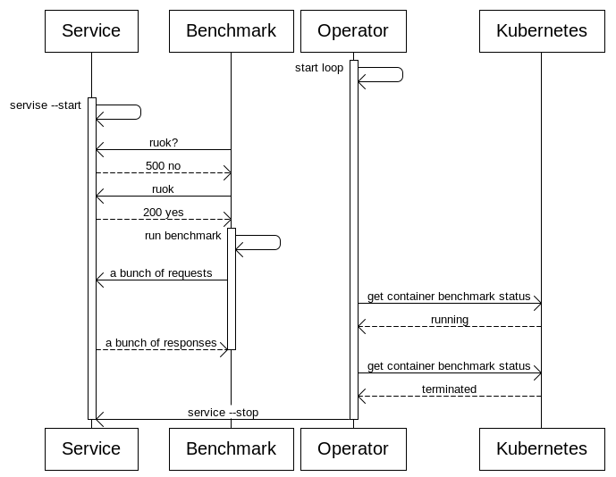
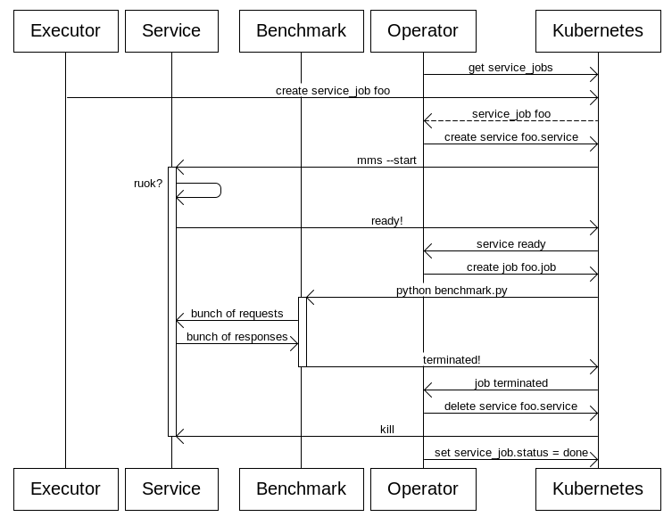

<!---
  Copyright 2019 Amazon.com, Inc. or its affiliates. All Rights Reserved.

  Licensed under the Apache License, Version 2.0 (the "License").
  You may not use this file except in compliance with the License.
  A copy of the License is located at

      http://www.apache.org/licenses/LICENSE-2.0

  or in the "license" file accompanying this file. This file is distributed
  on an "AS IS" BASIS, WITHOUT WARRANTIES OR CONDITIONS OF ANY KIND, either
  express or implied. See the License for the specific language governing
  permissions and limitations under the License.
-->
# Client-Server strategy for K8S Engine

## Problem

We have to run an (inference-) benchmark job. A typical use-case is to run a big set of requests from Apache Bench against MMS server.

### Why is it a problem for Anubis?

Currently we support the following distribution scenarios: single node and horovod (roughly any mpi task). In both scenarios we allow the user to provide a single docker image to be executed. The mentioned use case requires 2 containers with user defined containers - one for the client code (benchmark), one for (inference) server.

### Constraints

In this document we consider the service to be a single host application. It may schedule processes (in a CGI fashion) in the same container, but will not employ any slave nodes.

## Solution proposals

### O1. Change the user image to contain both the benchmark and the service. (IMMEDIATELY DISMISSED)

Con: Inacceptable performance impact on the service.

### O2. Run both the benchmark and the server as containers in the same pod.


* No network latency in the tests
* Simple design and implementation effort.
* In the particular use-case (Apache Bench against MMS) the performance impact is claimed by the MMS team to be insignificant. (IO threads of AB vs CPU threads of MMS).

Con:

* 1to1 relationship may be not always the case.
* In general we cannot guarantee the benchmark impact to be insignificant.


### Implementation details

### TOML Changes

We envision the following configuration:

```
#Our CS pair
strategy = "client-server"
#Additional image to serve as the service
[server]
docker_image="something-like/mms"
#The port to expose to the benchmark
port=80
live_probe="http://localhost:123/iamhere"
#The command to check if server is ready
ready_probe="http://localhost:123/iamok"
start="mms-server --start"
#The command to stop the server - kill -s SIGTERM 1 may be a reasonable fallback
stop="mms-server --stop"
```

### Inter-container communication

Expose a port from one container to another is a simple solution.

### POD TEMPLATE REQUIREMENTS

1. The benchmark container should start after the server container is ready.
2. The server container should be stopped after the benchmark container is finished

### Proposed high level design

The k8s template for client-server strategy can be implemented for example in a following way:

The pod template gets a 3rd “orchestrating” container, that will based on the status of the containers manipulate them based on the requirements previously mentioned.

Illustrated actors are containers in the pod.



By the implementation of the req1 different approaches are possible:

1. Prefix the actual benchmark code with a wait loop to check for the presense of service on the specific port e.g. with wget.
2. Start the benchmark container with **sleep 365s **and then inject the actual benchmark code with **kubectl exec. **In that case we have to finish the container (or the whole pod) from the operator as well.

The implementation of the req2 can be implented with some form of **kubectl exec** as well - that’s why we request user to provide a server shutdown command.

### O3. Run Service and the benchmark host from separate nodes.

Pro:

* Guarantee no performance impact.

Con:

* A bit more implementation effort

### TOML Changes

Mostly identical to O2 with unnecessary **server/stop**.

### Requirements

Similar to O2

1. The benchmark pod gets started just as the service is available
2. The service gets remove as soon as the benchmark pod is ready.

### Implementation details

Basically we have to orchestrate k8s objects in a similar way we do it in O2.



In a short summary we:

1. Start the service
2. Start the job
3. Wait for job termination
4. Delete the service

A suggested implementation will contain a k8s-operator, which controls a custom resource (explicit or implicit - explicit suggested) containing 2 sub objects: service (either a k8s service or just a pod) and a benchmark job, which is similar to our ordinary benchmark job.

An alternative like harbouring the orchestration logic in the executor/watcher seems no that clean to us.

### How do we discover the service?

### O3.1.1 We deploy service as a k8s service with a salted name (RECOMMENDED)

Pro:

* K8S does the discovery for us

Con:

* Service are globally visible - can be solved with namespaces later

### O3.1.2 We deploy service as a k8s pod

Pro:

* Better isolation of the “servers” between benchmark jobs.

Con:

* Unnecessary reimplementation of the discovery
