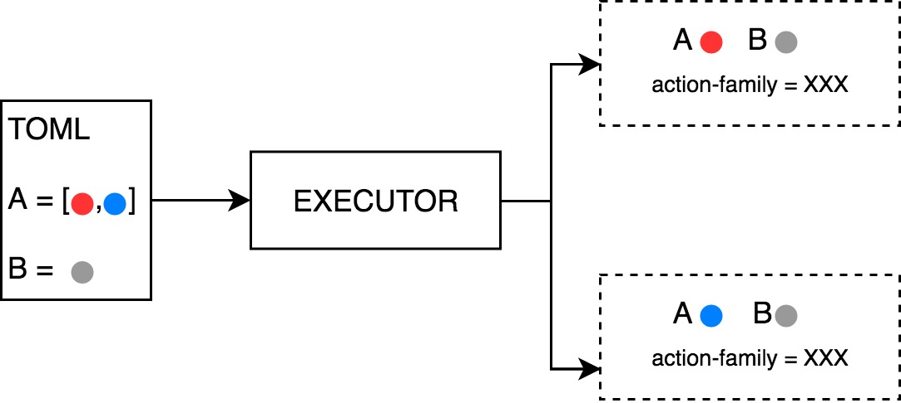

# RFC: Range capabilities in TOML

Let users specify ranges of values for TOML parameters so that multiple benchmark jobs can be defined using a single descriptor. 

**Author Name**: Jose Luis Contreras

**Author Date**: August 28, 2019


### Need

Often times, ML benchmarks try to compare the performance of different systems which only differ in one or a few parameters. In order to do this with the current Anubis, users would need to create and submit a new descriptor TOML file for each one of the possible parameter combinations they want to test. Using the improvement we propose here, this will be feasible using a single TOML file which specifies ranges of values (instead of simple values) for some parameters.


### Approach 

Adding this capability to the system would require some modifications:

1. Design a syntax for users to specify ranges or lists of values in their TOML files.  
2. Adding a descriptor preprocessing step to turn a TOML file containing lists into many individual descriptors, each one defining a single benchmark to be executed.
3. Add a new label to jobs, *action-family, *which serves to group benchmarks originated from the same TOML.


**Descriptor syntax**

To specify multiple values for a parameter, we use TOML arrays (https://github.com/toml-lang/toml#user-content-array). For example, the snippet would schedule two benchmarks, one running on p3.8xlarge instance and the second one running on a p3.16xlarge.

```
# ...
[hardware]
instance_type** **= ["p3.8xlarge", "p3.16xlarge"]
# ...
```

In case multiple fields use this feature, the resulting jobs correspond to the cartesian product of the different options. 


**Descriptor preprocessing**

The executor service is in charge of converting a TOML containing ranges into multiple jobs with only one value per parameter.



**parent-action-id label**

Similar to what is done with the scheduled benchmarks, all jobs derived from a TOML containing multiple-value parameters share a common label: *parent-action-id*. The value of this label corresponds to the action id of the message which submitted the original multi-value TOML. This is important because then this label can be used in a label selector to identify all these children jobs. For example, if the customer decides to cancel all jobs originated from a given multi-value TOML submitted with action id X, we can do so by deleting all jobs with *parent-action-id = X.*


### Benefit

This feature gives users an extremely convenient way to implement a very common use case. They can compare tens of different setups by submitting a single descriptor TOML file almost as simple as a single benchmark one. 

Besides, creating the concept of *action-family *opens the door for further improvements. For example, there could be special visualizations where benchmarks belonging to the same *action-family *are compared so customers can get detailed insights on how their different setups perform relative to each other.


### Competition (alternatives)

The current way for users to get the results this RFC describes is to submit a descriptor file for each one of the possible parameter combinations they want to test. This approach is time consuming and requires repetitive work which can be avoided if the solution proposed here is implemented.


### Non-goals 

In a first version, this feature would be limited to lists, meaning users can provide a list of possible values for a parameter. In the future, it could be extended to support ranges.

