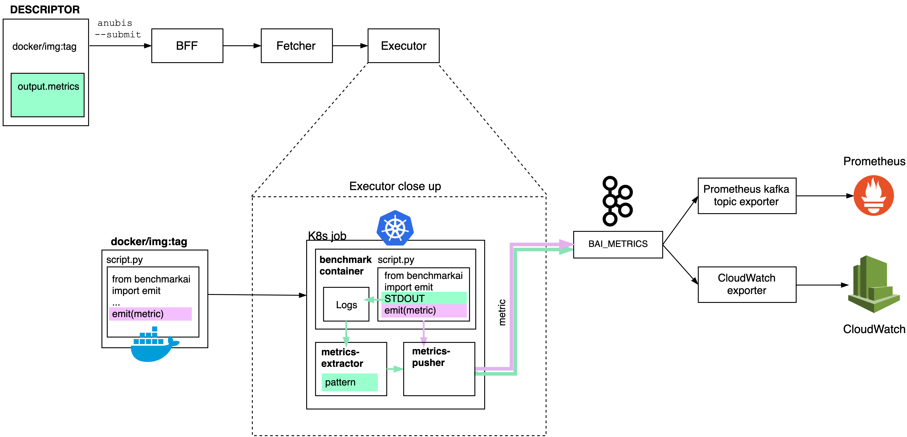

## Metrics pusher sidecar

The metrics-pusher runs as a sidecar on benchmark pods. It is in charge of emitting metrics to the corresponding Kafka topic
(defined in the BACKEND_ARG_TOPIC environment variable).

The diagram below illustrates the two paths metrics can take in Anubis:

- **Option 1 (pink path):** The code is instrumented using the benchmarkai client library, therefore calling emit(metric). 
The metrics-pusher sidecar will publish the metric to Kafka, where the Prometheus and CloudWatch exporters can pick it up. 
- **Option 2 (green path):** As an alternative to modifying the benchmark code, metrics can be parsed from the logs this
code produces. This is done by the [metrics-extractor sidecar](../metrics-extractor), which then calls emit(metric)
itself.
 
