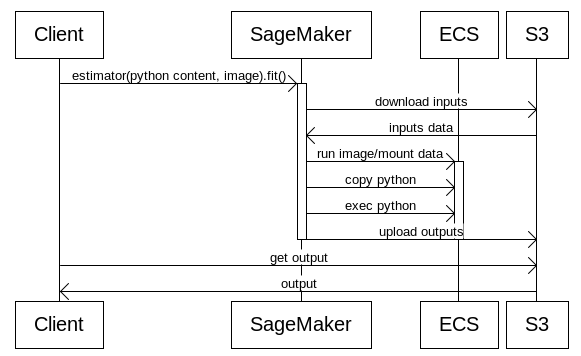

# SageMaker integration

This document provides a brief overview of SageMaker and how it is integrated with Anubis.

## Can SageMaker run arbitrary code?

Yes.

## How does SageMaker work low level?

https://docs.aws.amazon.com/sagemaker/latest/dg/your-algorithms-training-algo.html#your-algorithms-training-algo-running-container-dist-training

```
docker run image train
```

train is the predefined command to run in the container. (serve can be another one)

## What happens in ScriptMode?

Taking a look to the API - https://sagemaker.readthedocs.io/en/stable/estimators.html

User specifies **docker image**, **python script **and** dependencies**,** s3 inputs **and** s3 output.**

In a nutshell it does the following in ScriptMode:



1. Client gets the contents of the entry point file and POSTs them along with the request to the server.
2. [Image: sagemaker.png]
3. SageMaker creates a container with requested **image** 
4. The contents of the **python script**  are copied to the container
5. SageMaker does something to get **dependencies** to the container - some **pip install** ?
6. **s3 outputs** are downloaded - user provides a role to do that - after that they are mounted to the **container**.
7. The python is executed and the outputs are pushed to **s3 output**.


[Link](https://wsd.aka.amazon.com/?lz=cGFydGljaXBhbnQgQ2xpZW50IGFzIEMKAAwMU2FnZU1ha2VyIGFzIFNNAA8NRUNTIGFzIEVDUwAlDjMAJwUzCgpDIC0-IFNNOiBlc3RpbWF0b3IocHl0aG9uIGNvbnRlbnQsIGltYWdlKS5maXQoKQphY3RpdmF0ZSBTTQpTTS0-UzM6IGRvd25sb2FkIGlucHV0cwpTMy0-U006AAgHIGRhdGEAJwVFQ1M6IHJ1bgBMBi9tb3VudAAYBgBNCUVDUwAhCmNvcHkgAIEIBgA2CmV4ZWMACQxTMzogdXAAegVvdXQAewVkZQBDDQAEC1NNAIFqBzM6IGdldAArBwpTMyAtPiBDOgAICAogCgoKCg&s=default&h=m_Nq5oNyx5xYpUeJ)
That looks very similar to the way we run benchmarks.

More on how SageMaker runs containers: https://docs.aws.amazon.com/sagemaker/latest/dg/your-algorithms-training-algo.html#your-algorithms-training-algo-running-container-dist-training

## What's the requirements to run something on SageMaker?

**The container's entrypoint should just not die on train.**

So if ENTRYPOINT is **bash**, there should be **train** executable. If it's python script it should just digest the **train** arg.
https://github.com/aws/sagemaker-containers - sagemaker_containers library provides entrypoints for train/server.

## How do we run a custom bash on SageMaker?

[sagemaker-containers](https://github.com/aws/sagemaker-containers) can run py or bash entrypoints.
https://github.com/aws/sagemaker-containers/blob/master/src/sagemaker_containers/_entry_point_type.py

If it's a path with **setup.py** - execute as python package, else if it's a .py-file - run it as is. Otherwise we don't know better and it's probably just some command.

**NOTE**: But that doesn't mean, that any container using [sagemaker-containers](https://github.com/aws/sagemaker-containers) is able to do that. 
As of now 5/29/2019, dear reader from the bright future, 

TensorFlow container can run py or bash: https://github.com/icywang86rui/sagemaker-tensorflow-container/blob/merge-dockerfile/src/sagemaker_tensorflow_container/training.py#L157
MXNet container can just run py: https://github.com/laurenyu/sagemaker-mxnet-containers/blob/new-dockerfiles/src/sagemaker_mxnet_container/training.py#L77

Example: https://github.com/aws-samples/sagemaker-horovod-distributed-training/blob/master/src/horovod_launcher.py
There's a burger. 🍔 Python wrapper → bash wrapper for mpirun → mpirun → python benchmark


## What happens to watcher?

The watcher uses the SageMaker boto3 client to poll jobs for their state 
([see here](https://github.com/awslabs/benchmark-ai/blob/60d6ace7414f8b898762e4e4b88c62abd9c3ac77/watcher/src/bai_watcher/kafka_service_watcher.py#L137)).


## How do we embed client-library to the benchmark instance?

It's clearly a dependency to the python code. We just pass it to the estimator.


## How does the script discovers it's environment? (other hosts/data dirs/data/...)

### Raw image - FILES + ENV + CONVENTIONS

https://docs.aws.amazon.com/sagemaker/latest/dg/your-algorithms-training-algo.html#your-algorithms-training-algo-running-container-dist-training

An image gets a file **/opt/ml/input/config/resourceconfig.json** with the config data:

```
{
"current_host": "algo-1",
"hosts": ["algo-1","algo-2","algo-3"],
"network_interface_name":"eth1"
}
```

The data is mounted to /opt/ml/input/data/

### SageMaker image - ENV

We can use a provided library https://github.com/aws/sagemaker-containers/
This library wraps all the configuration in unified environment variables SM_HOSTS, SM_INPUT_DIR etc.

## How do we scale? How do we do horovod/parameter server?

Since it's a ECS, there's a lot of magic there compared to more straightforward k8s setup. Example: [https://github.com/aws-samples/sagemaker-horovod-distributed-training](https://github.com/aws-samples/sagemaker-horovod-distributed-training/)

1. mpirun is wrapped in python (example: https://github.com/aws-samples/sagemaker-horovod-distributed-training/blob/master/src/horovod_launcher.py
2. They do real ssh vs kubectl exec in k8s.
3. They fake gethostname system call. https://github.com/aws-samples/sagemaker-horovod-distributed-training/blob/master/docker/resources/changehostname.c
4. https://sagemaker.readthedocs.io/en/stable/sagemaker.tensorflow.html#tensorflow-estimator - we can enable MPI/Param Server in TensorFlow.
5. Number of instances is passed to estimator

The mentioned library https://github.com/aws/sagemaker-containers/ provides a lot of that out of the box.

Most of the time we can just add something like that to estimator.

```
     distributions={
         "mpi": {
             "enabled": True,
             "processes_per_host": 8,
             "custom_mpi_options": "-x SOMETHING",
         }
     },
```

## Are there images runnable on K8S, but not on SageMaker?

### The container cannot deal with train command.

Entrypoint fails to execute **train** for whatever reason. This can be actually the main issue with arbitrary container. We can run vanilla mxnet on 

### Different requirements for Horovod/Whatever distribution model

As opposed to K8S exec, ECS is limited to ssh - so mpirun does “real” ssh. We can imagine light-weighted horovod container without ssh.

## Are there images runnable on SageMaker, but not on K8S?

No. We just have more control over execution of the container.

